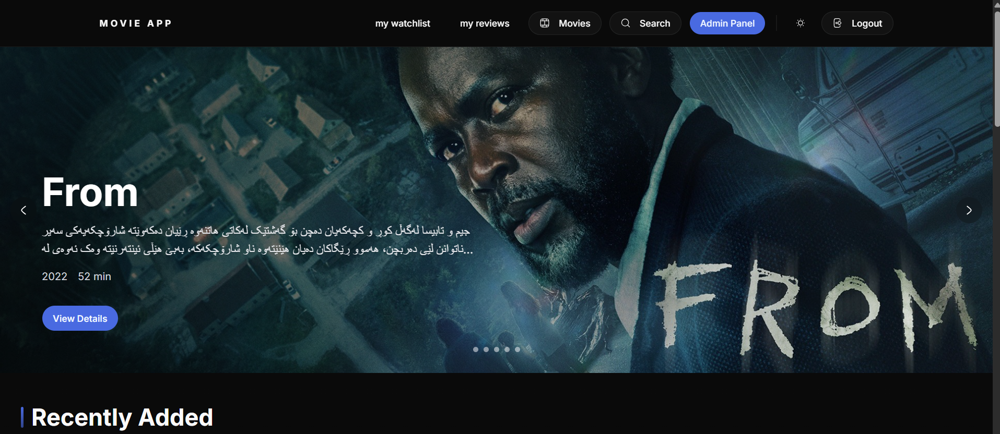
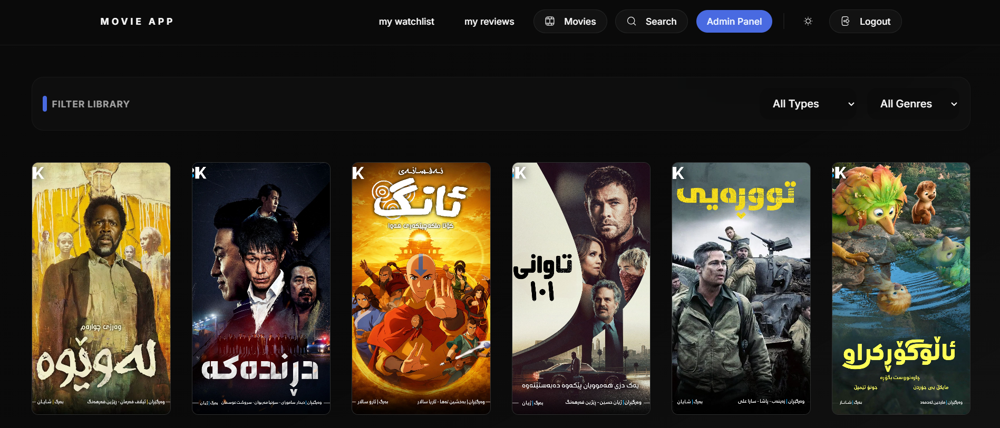
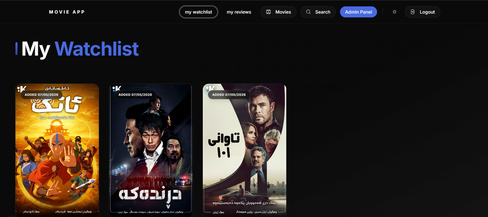
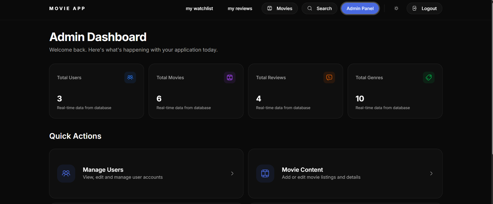
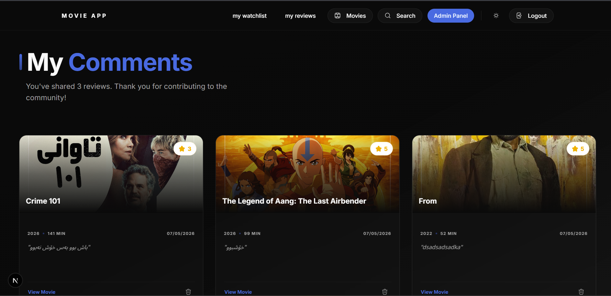
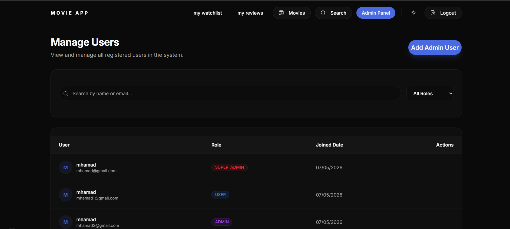
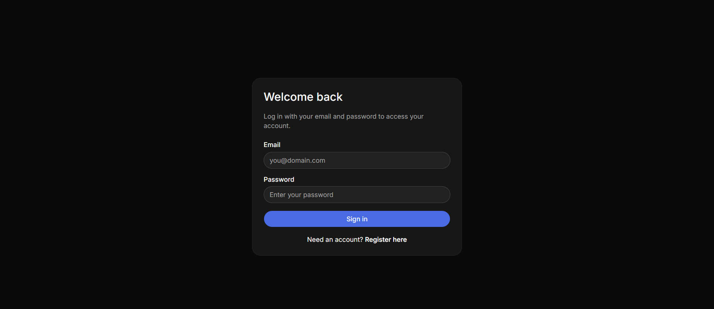
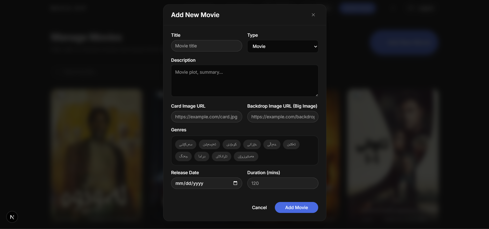

# Cinematic Movie Library & Admin Portal

A modern, full-stack movie discovery and management platform built with Spring Boot and Next.js.

## 📸 Screenshots

| Homepage | Movie Library |
| :---: | :---: |
|  |  |

| Watchlist | Admin Dashboard |
| :---: | :---: |
|  |  |

| reviews | user management |
| :---: | :---: |
|  |  |

| login | add movie |
| :---: | :---: |
|  |  |


## 🚀 Features

- **Movie Discovery**: Advanced server-side filtering by genre and content type (Movies/Series).
- **Pagination**: High-performance paginated movie listing with robust backend support.
- **User Engagement**:
  - Personal Watchlist for saving titles.
  - Rating and Review system with interactive star feedback.
  - Latest community reviews showcased on the homepage.
- **Admin Dashboard**:
  - Real-time statistics (Total Users, Movies, Reviews, Genres).
  - Comprehensive content management (CRUD for Movies and Genres).
  - Secure role-based access control.
- **Design**: Premium glassmorphic UI with dark mode support and smooth animations.

## 🛠️ Tech Stack

### Backend
- **Language**: Java 25
- **Framework**: Spring Boot 4.0
- **Security**: Spring Security + JWT (JSON Web Tokens)
- **Database**: PostgreSQL (Persistence), H2 (Testing)
- **ORM**: Hibernate / Spring Data JPA

### Frontend
- **Framework**: Next.js 15 (App Router)
- **Styling**: Tailwind CSS
- **UI Components**: Radix UI + Lucide/Hugeicons
- **State Management**: React Hooks + URL-based filtering

## 📦 Getting Started

### Prerequisites
- JDK 25+
- Node.js 20+
- PostgreSQL instance

### 1. Backend Setup
```bash
cd demo
# Configure database in src/main/resources/application.properties
./mvnw spring-boot:run
```

### 2. Frontend Setup
```bash
cd frontend
npm install
npm run dev
```

The application will be available at `http://localhost:3000`.

## 🔒 Security
The system uses JWT for stateless authentication. Admins have exclusive access to the dashboard and content management tools through the `@PreAuthorize` security layer.
